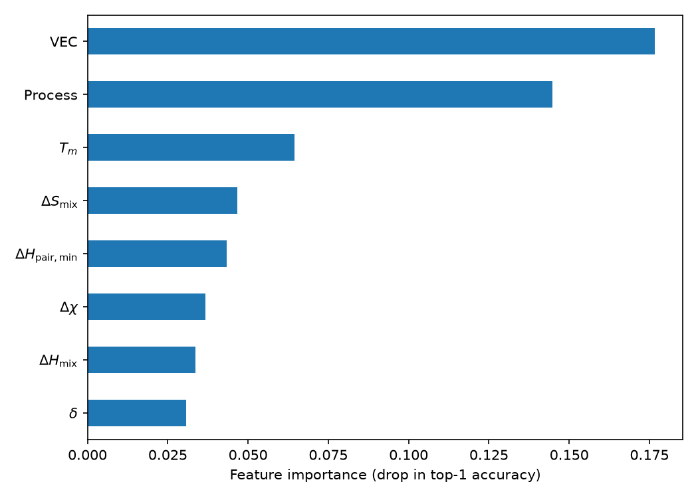
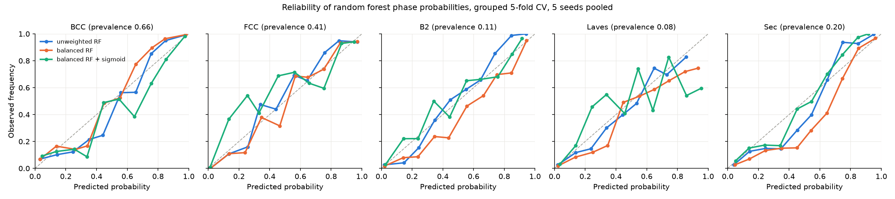

# High-Entropy Alloy Phase Prediction

Predicting which phases a high-entropy alloy forms (BCC, FCC, B2, Laves, secondary phase) and which phase combinations are most likely, from its composition and processing route alone.

Live app: https://high-entropy-alloys-phase-prediction-ntwaaikt4rzo4mdrdari4f.streamlit.app/

The model is a set of extra trees classifiers on 12 inputs: seven physics descriptors (atomic size mismatch, mixing enthalpy, mixing entropy, valence electron concentration, mean melting point and electronegativity spread from Hume-Rothery-style stability rules, plus the strongest pair mixing enthalpy among the alloy's elements) and five processing-route flags. It is evaluated with composition-grouped cross-validation, which avoids the data leakage typical of alloy datasets.

## Results

Evaluation: 5-fold `StratifiedGroupKFold`, repeated over 5 random seeds (mean ± std). Folds are grouped by normalised composition, so the same alloy never appears in both train and test. Scores are computed at alloy level: predicted probabilities are averaged over repeated measurements of the same composition (522 unique compositions), and the truth is the majority label.

### Per-phase prediction

One classifier per phase. The metric is average precision (AP). A model with no information scores the phase prevalence, so each AP should be read against that column. The baseline models below are balanced random forests on the six original physics descriptors (no `h_min_pair`); the final model is compared in the next section.

| Phase | Prevalence | Logistic regression, all features | RF, all 44 features | RF, 6 physics descriptors | RF, physics + processing |
|---|---|---|---|---|---|
| BCC | 0.628 | 0.937 ± 0.005 | 0.985 ± 0.002 | 0.975 ± 0.003 | 0.974 ± 0.005 |
| FCC | 0.471 | 0.937 ± 0.002 | 0.980 ± 0.003 | 0.969 ± 0.007 | 0.975 ± 0.009 |
| B2 | 0.148 | 0.583 ± 0.013 | 0.852 ± 0.021 | 0.780 ± 0.017 | 0.830 ± 0.025 |
| Laves | 0.071 | 0.383 ± 0.031 | 0.594 ± 0.038 | 0.474 ± 0.020 | 0.552 ± 0.036 |
| Secondary phase | 0.305 | 0.642 ± 0.010 | 0.859 ± 0.011 | 0.825 ± 0.013 | 0.839 ± 0.015 |

- **The six original physics descriptors recover almost all of the BCC and FCC signal.** They come within 0.011 AP of the full 44-feature model.
- **The gap grows for harder phases.** It is 0.03 to 0.07 for B2 and secondary phases and 0.12 for Laves. Laves formation probably depends on which elements are present, not only on bulk descriptors. Adding the processing route recovers part of the gap (0.47 to 0.55).
- **Laves is the hardest phase.** It appears in about 7% of alloys and its AP varies the most across seeds.

### Final model: extra trees with the strongest pair enthalpy

The final model replaces the random forest with extra trees, which is the main driver of the gain on the rare phases. It also adds a seventh descriptor, `h_min_pair`: the most negative Miedema pair enthalpy among the elements present (for example Ni-Zr or Al-Zr). This is a small, physically motivated addition. The concentration-weighted delta H mix averages one strongly bonding pair away, while intermetallic formation can hinge on it. The table separates the two effects. All four models are unweighted and use the same folds and seeds as above.

| Phase | RF, 11 inputs | RF + h_min_pair, 12 inputs | ET, 11 inputs | **ET + h_min_pair, 12 inputs (final)** |
|---|---|---|---|---|
| BCC | 0.976 ± 0.004 | 0.978 ± 0.004 | 0.977 ± 0.003 | **0.979 ± 0.003** |
| FCC | 0.975 ± 0.007 | 0.976 ± 0.008 | 0.982 ± 0.005 | **0.979 ± 0.008** |
| B2 | 0.819 ± 0.029 | 0.824 ± 0.027 | 0.856 ± 0.019 | **0.859 ± 0.020** |
| Laves | 0.568 ± 0.027 | 0.630 ± 0.025 | 0.619 ± 0.031 | **0.657 ± 0.029** |
| Secondary phase | 0.839 ± 0.011 | 0.848 ± 0.009 | 0.857 ± 0.016 | **0.871 ± 0.011** |

- **Extra trees drive the Laves and B2 gains.** On 10 further split seeds (5 to 14, model seed varied), extra trees beat the random forest on Laves by +0.065 (9 of 10 seeds) and on B2 by +0.036 (10 of 10). Extra trees pick split thresholds at random, which gives smoother probability rankings for rare classes. Bootstrapping is not the reason: a random forest without bootstrapping scores the same, and extra trees with bootstrapping keep the gain.
- **`h_min_pair` helps the random forest and secondary phases.** It lifts random-forest Laves AP by +0.040 (10 of 10 seeds 5 to 14) and extra-trees secondary-phase AP by +0.020 (10 of 10). On top of extra trees its Laves gain is +0.011 (6 of 10), which is within seed noise, and it adds nothing for B2.
- **Class weighting does not matter for extra trees.** Balanced and unweighted extra trees have the same AP (Laves 0.658 vs 0.657) and nearly the same calibration. Unweighted is slightly better for secondary phases (row-level Brier 0.084 vs 0.091), so the final phase models are unweighted.
- **What did not help Laves:** the Omega parameter, gamma and lambda parameters, VEC spread, radius-ratio descriptors, and gradient-boosted trees (scikit-learn, LightGBM, XGBoost), which scored 0.53 to 0.58. Adding the 28 element fractions raises Laves AP to about 0.72 but makes the model less physics-based, so the app does not use them.

Permutation importance in the final model (unweighted extra trees, 12 inputs, split seed 0): the drop in alloy-level AP when an input is shuffled within each held-out fold. Each descriptor is shuffled across alloys, with one value per composition so repeated alloys are not over-weighted. The five processing flags are shuffled together as one input (Process), across records, because the processing route can differ between records of the same alloy.

| Descriptor | BCC | FCC | B2 | Laves | Secondary |
|---|---|---|---|---|---|
| delta (size mismatch) | 0.016 | 0.013 | 0.109 | 0.002 | 0.021 |
| delta H mix | 0.003 | 0.006 | 0.156 | 0.010 | 0.046 |
| delta S mix | 0.004 | 0.010 | 0.128 | -0.002 | 0.068 |
| VEC | 0.058 | 0.191 | 0.093 | 0.159 | 0.087 |
| mean melting point | 0.042 | 0.018 | 0.100 | 0.086 | 0.078 |
| delta chi | 0.009 | 0.006 | 0.040 | 0.062 | 0.066 |
| h_min_pair | 0.006 | 0.004 | 0.045 | 0.067 | 0.131 |
| Process (5 flags) | 0.017 | 0.024 | 0.272 | 0.336 | 0.167 |


The figure shows the same values as the table. Rows are the seven descriptors, labelled with their symbols (δ size mismatch, ΔH<sub>mix</sub>, ΔS<sub>mix</sub>, VEC, T<sub>m</sub> mean melting point, Δχ, and ΔH<sub>pair,min</sub> for `h_min_pair`), plus one summed Process row for the five processing flags. Columns are the five phases, and darker cells mean a larger drop in AP. These are held-out permutation importances of the final model, not the impurity importances of the earlier 3-class random forest.

- **BCC and FCC barely depend on any single input except VEC.** VEC is the main input for FCC (0.19). BCC has no input above 0.06, probably because correlated descriptors can stand in for each other.
- **Processing matters most for the rare phases.** Shuffling the processing route costs 0.34 AP for Laves, 0.27 for B2 and 0.17 for secondary phases, more than any single descriptor. This matches the earlier gain from adding processing to the random forest (Laves 0.47 to 0.55). Process is shuffled across records rather than alloys, so its value is not strictly comparable with the descriptor rows.
- **Among the descriptors, B2 depends on mixing enthalpy, mixing entropy, size mismatch and melting point.** Laves depends on VEC, then melting point, then `h_min_pair`. Secondary phases depend most on `h_min_pair` (0.13).
- **The two enthalpy descriptors overlap.** Delta H mix mattered for Laves in the random forest (0.18 in the previous version of this table) but contributes little in the final model (0.01).
- Correlated descriptors share importance, so a low value does not prove a feature is unimportant. The values come from one split seed.

**Overall importance.** To see which input dominates across all phases, `research/importance_overall.py` repeats the permutation test on split seeds 0 to 4. The figure shows the phase-combination model, which predicts the whole phase set at once: the drop in alloy-level top-1 accuracy (base 0.712), averaged over the five seeds. The script also prints the drop in AP averaged over the five phase models, and its seed 0 values reproduce the table above exactly.



- **VEC is the most important descriptor in both views.** Shuffling it costs 0.18 top-1 accuracy in the combination model, nearly three times the next descriptor (mean melting point, 0.06), and 0.10 mean AP across the phase models, against 0.07 for melting point.
- **Processing is about as important as VEC.** It is first by mean AP (0.14, against 0.10 for VEC) because it dominates B2, Laves and secondary phases, and second in the combination model (0.15 against 0.18). Process is shuffled across records while the descriptors are shuffled across alloys, so this comparison is approximate.
- **The other descriptors are close together.** Melting point, mixing entropy, `h_min_pair`, Δχ, mixing enthalpy and size mismatch each cost 0.03 to 0.07, with seed-to-seed spreads of about 0.01, so their order beyond melting point is not reliable. Correlated descriptors share importance here as well.

### Probability calibration

The per-phase forests output probabilities, so it matters whether those probabilities match observed frequencies. `research/calibration.py` checks this under the same grouped 5-fold CV and 5 seeds, using the physics + processing inputs. It compares a forest trained with `class_weight="balanced"` against an unweighted forest, each raw and with sigmoid or isotonic calibration. The calibrators are fitted on grouped inner-CV predictions inside each training fold, so no alloy is used both to fit a calibrator and to test it. Brier score and expected calibration error (ECE, 10 bins) are computed per record.

| Phase | Prevalence | RF balanced: mean p, Brier, ECE | RF unweighted: mean p, Brier, ECE | Balanced + sigmoid: Brier, ECE | Balanced + isotonic: Brier, ECE |
|---|---|---|---|---|---|
| BCC | 0.656 | 0.632, 0.061, 0.052 | 0.651, 0.062, 0.053 | 0.060, 0.037 | 0.059, 0.028 |
| FCC | 0.407 | 0.418, 0.042, 0.034 | 0.408, 0.042, 0.039 | 0.043, 0.021 | 0.043, 0.016 |
| B2 | 0.114 | 0.147, 0.058, 0.038 | 0.116, 0.055, 0.030 | 0.055, 0.015 | 0.057, 0.033 |
| Laves | 0.077 | 0.104, 0.052, 0.036 | 0.081, 0.053, 0.022 | 0.054, 0.027 | 0.057, 0.029 |
| Sec | 0.199 | 0.297, 0.106, 0.102 | 0.240, 0.094, 0.066 | 0.091, 0.039 | 0.091, 0.029 |

- **`class_weight="balanced"` inflates minority-phase probabilities under grouped CV.** Secondary-phase probabilities average 0.30 against an observed rate of 0.20 (ECE 0.10), and B2 averages 0.15 against 0.11. BCC and FCC are already close to calibrated.
- **Dropping the class weighting removes most of this bias without hurting ranking.** The unweighted forest's alloy-level AP is 0.976 (BCC), 0.975 (FCC), 0.819 (B2), 0.568 (Laves) and 0.839 (Sec). The balanced forest's AP, shown in the table above, is 0.974, 0.975, 0.830, 0.552 and 0.839.
- **Sigmoid and isotonic calibration hurt Laves.** There are too few Laves alloys to fit a calibrator, so Laves Brier rises from 0.052 to 0.054 (sigmoid) and 0.057 (isotonic), and Laves AP falls from 0.51 to 0.47 and 0.42 at record level. For B2 and secondary phases, calibration lowers ECE further. Both calibrators also cost about 0.02 AP on FCC.



Reliability curves pooled over the 5 seeds, per record. Bins with fewer than 10 records are not shown.

This study covers the random forests. The final model uses unweighted extra trees: for extra trees, class weighting leaves AP unchanged and the unweighted versions are slightly better calibrated (see the final model section above and the phase combination section below).

### Check on three unseen alloys

Three annealed NbCrTiAlZr alloys that are not in the training data, all reported as BCC + Laves (Nb is the balance). Each model is trained on all data.

| Alloy (at.%) | Model | BCC | FCC | B2 | Laves | Sec | Top 3 combinations |
|---|---|---|---|---|---|---|---|
| Nb36Cr16Ti16Al16Zr16 | Previous (balanced RF, 11 inputs) | 0.90 | 0.00 | 0.29 | 0.44 | 0.27 | **BCC+Laves 0.35**, BCC 0.28, BCC+Sec 0.16 |
| | ET, 11 inputs | 0.67 | 0.00 | 0.23 | 0.38 | 0.36 | BCC 0.45, other 0.21, BCC+Laves 0.16 |
| | ET + h_min_pair (final) | 0.47 | 0.01 | 0.54 | 0.34 | 0.51 | other 0.55, BCC 0.25, BCC+Laves 0.13 |
| Nb47Cr16Ti16Al5Zr16 | Previous | 0.98 | 0.01 | 0.00 | 0.50 | 0.19 | **BCC+Laves 0.41**, BCC+Sec 0.31, BCC 0.27 |
| | ET, 11 inputs | 0.88 | 0.02 | 0.01 | 0.25 | 0.19 | BCC 0.44, BCC+Laves 0.38, BCC+Sec 0.12 |
| | ET + h_min_pair (final) | 0.77 | 0.03 | 0.22 | 0.42 | 0.25 | BCC 0.35, BCC+Laves 0.29, other 0.14 |
| Nb50Cr16Ti16Al2Zr16 | Previous | 0.99 | 0.02 | 0.02 | 0.39 | 0.33 | BCC+Sec 0.40, BCC 0.29, BCC+Laves 0.25 |
| | ET, 11 inputs | 0.90 | 0.02 | 0.02 | 0.17 | 0.13 | BCC 0.51, BCC+Laves 0.25, BCC+Sec 0.18 |
| | ET + h_min_pair (final) | 0.80 | 0.03 | 0.16 | 0.38 | 0.24 | BCC 0.34, BCC+Laves 0.32, BCC+Sec 0.12 |

The result is mixed. Top-3 accuracy is unchanged: BCC+Laves is in the top 3 for all three alloys with every model. Top-1 accuracy fell. BCC+Laves was the top combination for two of the three alloys with the previous model and is top for none with the final model. For the 5% and 2% Al alloys, BCC is ahead of BCC+Laves by 0.06 and 0.02. For the 16% Al alloy, `other` leads with 0.55 and BCC+Laves is third with 0.13. Laves probabilities are not higher than the previous model's (0.34 to 0.42 vs 0.39 to 0.50). Compared with extra trees without it, `h_min_pair` raises the B2 probability for all three alloys (0.23 to 0.54, 0.01 to 0.22 and 0.02 to 0.16), although none of them is reported with B2. No training alloy contains Al together with both Cr and Zr, so these compositions are outside the data the model has seen (see Limitations). Three alloys are an illustration, not a validation.

### Phase combinations

Each distinct combination of the five phases is treated as one class (for example `BCC+FCC` or `BCC+Laves`). Combinations with fewer than 15 records are merged into one `rare_combo` class, which leaves 11 classes. The most frequent are BCC (488 records), FCC (273), BCC+Sec (104), FCC+Sec (100) and BCC+FCC (94). Brier is the alloy-level multiclass Brier score (sum over classes) and ECE the calibration error of the top-1 confidence (10 bins), both lower is better.

| Inputs (balanced random forest unless stated) | Top-1 accuracy | Top-3 accuracy | Brier | ECE |
|---|---|---|---|---|
| 6 physics descriptors | 0.652 ± 0.009 | 0.904 ± 0.013 | 0.495 ± 0.005 | 0.052 ± 0.011 |
| 6 physics descriptors + processing (previous) | 0.676 ± 0.013 | 0.910 ± 0.013 | 0.472 ± 0.005 | 0.066 ± 0.007 |
| Balanced extra trees, 12 inputs | 0.714 ± 0.007 | 0.914 ± 0.006 | 0.412 ± 0.003 | 0.048 ± 0.003 |
| Unweighted extra trees, 11 inputs | 0.699 ± 0.009 | 0.907 ± 0.006 | 0.428 ± 0.007 | 0.047 ± 0.018 |
| **Unweighted extra trees, 12 inputs with h_min_pair (final)** | **0.712 ± 0.009** | **0.913 ± 0.008** | **0.409 ± 0.005** | **0.042 ± 0.011** |
| Majority-class baseline | 0.259 | | | |

Compared with the previous combination model (balanced random forest, 11 inputs), top-3 accuracy is essentially unchanged (0.910 to 0.913). The gain is in top-1 accuracy (0.676 to 0.712) and probability quality: alloy-level multiclass Brier score falls from 0.472 to 0.409 and the calibration error of the top-1 confidence from 0.066 to 0.042.

For the combination model, balanced and unweighted extra trees have the same accuracy (12 inputs: top-1 0.714 vs 0.712, top-3 0.914 vs 0.913), but the unweighted model is better calibrated: alloy-level multiclass Brier 0.409 vs 0.412, and top-1 confidence ECE 0.042 vs 0.048. The final combination model is therefore unweighted. Dropping the class weights also helps the random forest (top-1 0.676 to 0.698).

### Baseline: BCC / FCC / other

The first version of this project predicted three classes. Alloy-level results with a random forest (balanced) and 42 features, before adding mixing enthalpy:

| Model | Row macro F1 | Alloy accuracy | Alloy macro F1 | FCC recall | Other recall |
|---|---|---|---|---|---|
| Majority-class baseline | 0.214 ± 0.000 | 0.615 | 0.254 | 0.00 | 1.00 |
| Logistic regression | 0.686 ± 0.021 | 0.724 ± 0.007 | 0.675 ± 0.009 | 0.574 ± 0.021 | 0.777 ± 0.004 |
| **Random forest (balanced)** | **0.722 ± 0.018** | **0.786 ± 0.013** | **0.748 ± 0.014** | 0.652 ± 0.025 | 0.823 ± 0.017 |

Adding mixing enthalpy left the random forest unchanged (alloy macro F1 0.748 to 0.748) and improved logistic regression (0.675 to 0.700, alloy accuracy 0.724 to 0.749). The 3-class setup hides most of the structure, since `other` lumps together B2, Laves and secondary-phase alloys, which is why the project moved to multi-label prediction.

## Web app

`app.py` is a Streamlit app. Enter a composition and a processing route to get a probability for each of the five phases, the three most likely phase combinations, and the seven computed descriptors. It also warns when the composition is in the training data (probabilities are then optimistic), when elements are rare in the data, and that Laves and B2 predictions are the least reliable.

```bash
pip install -r requirements.txt
streamlit run app.py
```

## Pipeline

```
High Entropy Alloy Properties.csv
        |  research/data.py
        v
cleaned_data.csv
        |  research/feature.py
        v
features.csv + target.csv
        |  research/label.py
        v
labels.csv
        |  research/modelling_multilabel.py
        v
metrics

cleaned_data.csv --> train_final.py --> model.joblib --> app.py
```

| File | Purpose |
|---|---|
| `research/data.py` | Cleans column names, drops unused columns, removes rows with missing microstructure or processing method |
| `research/feature.py` | Parses formulas into element fractions and computes composition-based descriptors, including mixing enthalpy and the strongest pair enthalpy |
| `research/label.py` | Splits the microstructure string into binary phase labels |
| `research/modelling.py` | 3-class baseline with grouped cross-validation, and impurity importances of the 3-class random forest |
| `research/modelling_multilabel.py` | Multi-label evaluation: per-phase AP for the baseline models, the random forest vs extra trees and `h_min_pair` comparison, class weighting and calibration of the final model, permutation importance of the seven descriptors and the processing flags, and `research/feature_importance.png`, and phase-combination accuracy and calibration |
| `research/importance_overall.py` | Overall permutation importance across all phases (combination model and phase-averaged), split seeds 0 to 4, and the bar chart `research/feature_importance_overall.png` |
| `research/leakage.py` | Random vs composition-grouped cross-validation for the per-phase and combination random forests, writes `leakage_results.csv` |
| `research/calibration.py` | Reliability curves, Brier score and ECE of the per-phase forests (balanced and unweighted, with and without sigmoid and isotonic calibration), and the reliability figure |
| `featurize.py` | Computes the same descriptors for a single composition typed into the app |
| `train_final.py` | Trains the five phase models and the combination model (unweighted extra trees, 12 inputs) on all data and writes `model.joblib` |
| `app.py` | Streamlit app |
| `miedema_matrix.csv` | Symmetric 28 x 28 matrix of pair mixing enthalpies built from `MiedemaLiquidDeltaHf.tsv` |

## Data

- 1354 records, 522 unique compositions after normalising to atomic fractions
- Source: High Entropy Alloy Properties dataset (https://www.kaggle.com/datasets/sethpointaverage/high-entropy-alloys-properties/data)
- Pair mixing enthalpies for the Miedema model come from the `MiedemaLiquidDeltaHf.tsv` data file shipped with matminer
- CSV files are excluded from the repository by `.gitignore`, except `miedema_matrix.csv`. Place the raw CSV in the project folder and run the scripts in order.

Phase labels come from splitting the `microstructure` string on `+`: BCC, FCC, B2, Laves and secondary phase (`Sec.`). HCP, L12 and Other are rare and are not predicted. 31 records carry none of the five labels.

## Features (44)

| Group | Count | Description |
|---|---|---|
| Element fractions | 28 | Molar fraction of each of the 28 elements in the dataset |
| Mean elemental properties | 4 | Composition-weighted mean atomic radius, electronegativity, melting point and VEC |
| Mismatch descriptors | 2 | Atomic size mismatch (delta, %) and electronegativity spread (delta chi) |
| Mixing entropy | 1 | Ideal mixing entropy, -R sum(c ln c) |
| Mixing enthalpy | 1 | Miedema model, delta H mix = sum over pairs of 4 H_ij c_i c_j |
| Strongest pair enthalpy | 1 | `h_min_pair`, the most negative Miedema H_ij among the pairs of elements present |
| Number of elements | 1 | Count of elements with non-zero fraction |
| Processing route | 5 | One-hot: cast, wrought, anneal, powder, other |
| Density | 1 | Calculated density from the source dataset |

The final model and the app use 12 inputs: seven physics descriptors (delta, delta H mix, delta S mix, VEC, mean melting point, delta chi, h_min_pair) and five processing flags. Microstructure, yield strength and hardness are not used as inputs, since microstructure is a finer description of the target and would leak the answer.

## Validation design

The dataset contains many repeated compositions: 831 of 1354 rows repeat a formula already seen, and one alloy (HfNbTaTiZr) alone accounts for 86 rows. A random split would put copies of the same alloy in both train and test and inflate every score.

- Folds are built with `StratifiedGroupKFold`, grouping by composition normalised to atomic fractions (so `Co1 Fe1 Ni1` and `Co2 Fe2 Ni2` count as one alloy). For stratification each alloy gets a single priority label (Laves, B2, Sec, FCC, otherwise BCC).
- Splits are checked with assertions: no composition appears in two folds and every row is assigned.
- Every comparison is repeated over 5 split seeds. Differences smaller than the seed-to-seed standard deviation are treated as noise.
- Feature scaling for logistic regression is fitted inside each training fold through a pipeline.

## How much does a random split inflate the scores?

`research/leakage.py` reruns the random forest models with a plain random split and compares them to the grouped split. Both use 5 folds, the same 5 seeds, the same stratification label and the same alloy-level metrics. The only difference is that the random split (`StratifiedKFold`) ignores composition, so on average 72% of test rows have the same composition in the training folds (0% for the grouped split). The gap is random minus grouped, mean ± std over the 5 seeds.

| Phase | Prevalence | RF all 44 features: grouped | random | gap | RF physics + processing: grouped | random | gap |
|---|---|---|---|---|---|---|---|
| BCC | 0.628 | 0.985 ± 0.002 | 0.992 ± 0.000 | +0.007 ± 0.002 | 0.974 ± 0.005 | 0.988 ± 0.003 | +0.014 ± 0.007 |
| FCC | 0.471 | 0.980 ± 0.003 | 0.988 ± 0.007 | +0.007 ± 0.009 | 0.975 ± 0.009 | 0.981 ± 0.009 | +0.006 ± 0.014 |
| B2 | 0.148 | 0.852 ± 0.021 | 0.897 ± 0.015 | +0.045 ± 0.012 | 0.830 ± 0.025 | 0.893 ± 0.022 | +0.063 ± 0.017 |
| Laves | 0.071 | 0.594 ± 0.038 | 0.888 ± 0.020 | **+0.294 ± 0.051** | 0.552 ± 0.036 | 0.859 ± 0.021 | **+0.307 ± 0.044** |
| Secondary phase | 0.305 | 0.859 ± 0.011 | 0.908 ± 0.009 | +0.049 ± 0.013 | 0.839 ± 0.015 | 0.898 ± 0.009 | +0.059 ± 0.016 |

With the 6 physics descriptors alone the gaps are BCC +0.013, FCC +0.010, B2 +0.097, Laves +0.389 and secondary phase +0.070 (Laves AP 0.474 grouped vs 0.863 random).

| Phase combinations | Grouped | Random | Gap |
|---|---|---|---|
| Physics, top-1 | 0.652 ± 0.009 | 0.741 ± 0.007 | +0.089 ± 0.009 |
| Physics, top-3 | 0.904 ± 0.013 | 0.934 ± 0.007 | +0.031 ± 0.013 |
| Physics + processing, top-1 | 0.676 ± 0.013 | 0.764 ± 0.004 | +0.088 ± 0.010 |
| Physics + processing, top-3 | 0.910 ± 0.013 | 0.944 ± 0.012 | +0.034 ± 0.009 |

- **Leakage is small for BCC and FCC and large for the rare phases.** BCC and FCC gain under 0.015 AP, close to seed noise, because VEC separates them well for unseen alloys too. B2 and secondary phases gain 0.045 to 0.10.
- **A random split makes Laves look solved.** Laves AP rises from about 0.5 to about 0.86 to 0.89, so most of the apparent Laves skill under a random split is memorising repeated alloys.
- **Combination accuracy is inflated by about 9 points at top-1** (0.68 to 0.76 with processing).
- **Removing element fractions does not remove the leakage.** With the 6 physics descriptors only, the random split lifts Laves by 0.39 and B2 by 0.10, more than with all 44 features, because six continuous descriptors are still enough to recognise a repeated composition.

## Limitations

- Composition and a coarse processing category are the only inputs. Heat treatment, which controls precipitation of secondary phases, is not captured.
- Laves and B2 predictions are the least reliable, and Laves AP varies the most across seeds.
- No training alloy contains Al together with both Cr and Zr, so Al-bearing NbCrTiZr-type alloys such as those in the external check are extrapolation. Al does appear with Nb, Ti and Zr in 64 training records.
- 32 formulas carry conflicting labels across records (different processing, or label noise), which caps achievable accuracy.
- Compositions that differ only slightly (for example Al0.3 and Al0.304) are treated as different alloys and can still fall on opposite sides of a split.
- 19 element pairs have no tabulated Miedema value and are set to zero when computing mixing enthalpy.
- Probabilities are not post-hoc calibrated. The calibration study above found that sigmoid and isotonic calibration hurt Laves for the random forest; it has not been repeated for extra trees. The per-phase permutation importances above come from a single split seed of the final model; the overall importances use five.
- VEC values are hand-entered and follow one literature convention.

## Possible extensions

- Repeat the calibration study (`research/calibration.py`) for the extra trees models, including post-hoc calibration of B2 and secondary phases
- Test the model on more alloys from outside the dataset, especially Al-bearing refractory compositions with Cr and Zr
- Test whether dropping size mismatch alone changes Laves performance
- Use the same features for hardness and yield strength regression

## Reproduce

```bash
pip install pandas numpy scikit-learn pymatgen matplotlib
python research/data.py
python research/feature.py
python research/label.py
python research/modelling_multilabel.py
python research/leakage.py
python research/calibration.py
python train_final.py
streamlit run app.py
```

Run every command from the repository root. The numbers in this README were produced with scikit-learn 1.9.1, the version pinned in `requirements.txt`. Random forest scores shift slightly across scikit-learn versions.
