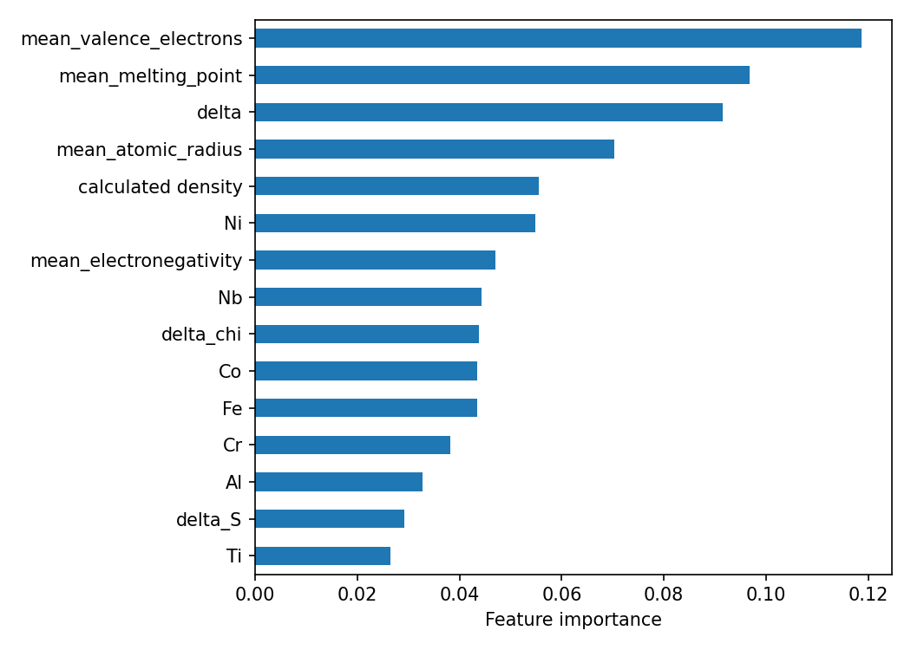

# High-Entropy Alloy Phase Prediction

Predicting whether a high-entropy alloy forms a **BCC**, **FCC** or **other** phase from its chemical composition and processing route alone.

The model is built on physics-based descriptors from Hume-Rothery-style phase stability rules (valence electron concentration, atomic size mismatch, mixing entropy) and evaluated with a composition-grouped cross-validation scheme that avoids the data leakage typical of alloy datasets.

## Results

Evaluation: 5-fold `StratifiedGroupKFold`, repeated over 5 random seeds (mean ± std). Folds are grouped by normalised composition so the same alloy never appears in both train and test.

Two views are reported. **Row level** scores all 1354 records. **Alloy level** collapses repeated measurements of the same composition to a single majority label (522 unique compositions), so heavily repeated alloys cannot dominate the score.

| Model | Row macro F1 | Alloy accuracy | Alloy macro F1 | FCC recall | Other recall |
|---|---|---|---|---|---|
| Majority-class baseline | 0.216 ± 0.002 | 0.615 | 0.254 | 0.00 | 1.00 |
| Logistic regression | 0.667 ± 0.009 | 0.719 ± 0.009 | 0.670 ± 0.012 | 0.566 ± 0.042 | 0.763 ± 0.008 |
| **Random forest (balanced)** | **0.724 ± 0.019** | **0.804 ± 0.006** | **0.754 ± 0.012** | 0.564 ± 0.050 | 0.875 ± 0.006 |

Alloy-level confusion matrix for the final model (seed 0, rows are true labels):

| True \ Predicted | BCC | FCC | other |
|---|---|---|---|
| BCC | 96 | 0 | 28 |
| FCC | 0 | 38 | 39 |
| other | 22 | 17 | 282 |

### Key findings

- **BCC and FCC are almost never confused.** Across every run, a BCC alloy was essentially never predicted as FCC or the reverse. Mean valence electron concentration (VEC) separates the classes cleanly: BCC 4.9, other 6.6, FCC 8.1 on average, consistent with the known VEC rule for FCC/BCC stability.
- **Almost all errors involve the `other` class**, mostly single-phase alloys predicted as `other`.
- **Physics-based descriptors dominate the feature ranking.** Mean VEC, mean melting point, atomic size mismatch (delta) and mean atomic radius are the four most important features, ahead of every individual element fraction.



## Pipeline

```
High Entropy Alloy Properties.csv
        |  data.py
        v
cleaned_data.csv
        |  feature.py
        v
features.csv + target.csv
        |  modelling.py
        v
metrics, confusion matrix, feature_importance.png
```

| File | Purpose |
|---|---|
| `data.py` | Cleans column names, drops unused columns, removes rows with missing microstructure or processing method |
| `feature.py` | Parses formulas into element fractions and computes composition-based descriptors |
| `modelling.py` | Grouped cross-validation, model comparison, error analysis inputs, feature importance |

## Data

- 1354 records, 523 unique formula strings (522 after normalising composition)
- Class counts: other 639, BCC 463, FCC 252
- Source: High Entropy Alloy Properties dataset (SOURCE LINK TO BE ADDED)
- CSV files are excluded from the repository by `.gitignore`. Place the raw CSV in the project folder and run the scripts in order.

## Features (42)

| Group | Count | Description |
|---|---|---|
| Element fractions | 28 | Molar fraction of each of the 28 elements in the dataset, parsed from the formula string |
| Mean elemental properties | 4 | Composition-weighted mean atomic radius, electronegativity, melting point and VEC |
| Mismatch descriptors | 2 | Atomic size mismatch (delta, %) and electronegativity spread (delta chi) |
| Mixing entropy | 1 | Ideal mixing entropy, -R sum(c ln c) |
| Number of elements | 1 | Count of elements with non-zero fraction |
| Processing route | 5 | One-hot: cast, wrought, anneal, powder, other |
| Density | 1 | Calculated density from the source dataset |

Atomic radius, electronegativity and melting point come from `pymatgen`. VEC values are entered by hand following the convention used in the high-entropy alloy literature (for example Zn = 12).

Microstructure, yield strength and hardness are deliberately **not** used as inputs. Microstructure is a finer-grained description of the target and would leak the answer.

## Validation design

The dataset contains many repeated compositions: 831 of 1354 rows are repeats of a formula already seen, and one alloy (HfNbTaTiZr) alone accounts for 86 rows. A random split would put copies of the same alloy in both train and test and inflate every score.

- Folds are built with `StratifiedGroupKFold`, grouping by composition normalised to atomic fractions (so `Co1 Fe1 Ni1` and `Co2 Fe2 Ni2` count as one alloy).
- Splits are checked with assertions: no composition appears in two folds and every row is assigned.
- Every comparison is repeated over 5 split seeds. The seed-to-seed standard deviation of alloy-level macro F1 is about 0.01, so differences smaller than roughly 0.02 are treated as noise.
- Feature scaling for logistic regression is fitted inside each training fold through a pipeline.

## Error analysis

- The `other` label means "not a pure BCC or pure FCC solid solution". Of the 639 `other` rows, 273 contain only BCC-type phases, 147 only FCC-type phases, 152 both, and 67 neither; 270 carry a secondary phase tag. Many of these are BCC or FCC matrices with minor secondary phases, which are hard to tell apart from single-phase alloys using composition alone.
- Errors are concentrated in a few alloy families. In an error analysis of an earlier random forest run, the ten worst compositions accounted for 120 of 336 row-level errors; the largest single source was the Cantor alloy CoCrFeMnNi, repeatedly predicted as `other` although labelled FCC.
- Missed FCC alloys have a mean VEC similar to correctly classified ones (8.0 vs 8.1) but contain more elements and a higher mixing entropy (13.3 vs 11.4), suggesting the model has learned "complex composition implies other".
- Class-weight balancing raised FCC recall by about 0.06 without reducing `other` recall.

## Limitations

- Composition and a coarse processing category are the only inputs. Heat treatment, which controls precipitation of secondary phases, is not captured.
- 32 formulas carry conflicting labels across records (different processing, or label noise), which caps achievable accuracy.
- Compositions that differ only slightly (for example Al0.3 and Al0.304) are treated as different alloys and can still fall on opposite sides of a split.
- Only about 77 unique FCC alloys exist, so FCC recall has a wide uncertainty (std 0.05 across seeds).
- Tree-based feature importance is shared between correlated features (VEC, radius, density and element fractions overlap), so the ranking indicates tendencies rather than exact contributions.
- VEC values are hand-entered and follow one literature convention.

## Possible extensions

- Add mixing enthalpy and the Omega parameter to target intermetallic-forming alloys
- Predict microstructure as a multi-label problem (BCC present, FCC present, B2, Laves, secondary phase)
- Use the same features for hardness and yield strength regression

## Reproduce

```bash
pip install pandas numpy scikit-learn pymatgen matplotlib
python data.py
python feature.py
python modelling.py
```

`modelling.py` prints the metrics tables and saves `feature_importance.png`.
